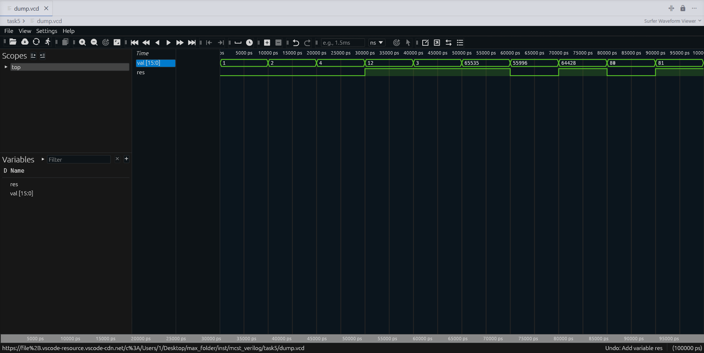

# mcst_verilog

## task1
написать и протестировать модуль, определяющий, четное ли число подано на вход
## task2
написать модуль дешифратор 3-8
- на вход подается 3-битное число
- на выходе вектор в котором 1 выставлена в разряде с номером этого числа, остальные разряды нулевые
## task3
написать модуль "логарифм по основанию 2:
- на входе 8-битное число "степень двойки" (1, 2, ..., 128)
- на выходе значение логарифма входного числа, т.е. величина степени
## task4
написать модуль "приоритетный дешифратор 8-3", определяющий номер старшей единицы в 8-битном векторе
## task5
написать модуль, определяющий, делится ли входное число на 3  

в этой задаче было реализовано два модуля - так как входное число 16-битное, - один из которых вспомогательный и решающий задачу с подаваемым на вход меньшим числом, длиной в машинное слово.  

результат выполнения модуля:

